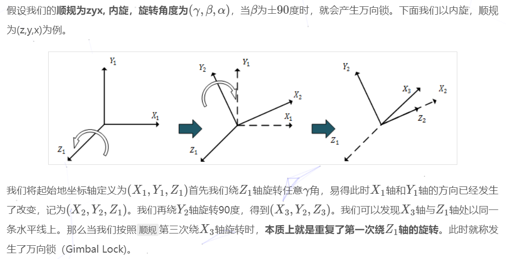

## 1.定义
> 在某些特殊情况下，欧拉角表示的内旋会出现绕某个轴的旋转覆盖另一个轴的旋转，也就是说绕两个旋转轴的效果是一样的，导致物体丢失一个自由度

比如物体先绕x轴转40度，在绕y轴转90度，最后绕z轴转40度。物体第一次与第三次的旋转效果是一样的，丢失了z轴的自由度

## 2.产生原因
> 对于一个欧拉角表示的内旋，如果第二次的旋转角度为±90度,会导致第三次与第一次的旋转轴平行，最终导致第一次与第三次旋转的效果相同

## 3.解决
> 1.限制旋转角度，避免第二次转±90度
> 2.四元数

## 参考
> * <https://hideoninternet.github.io/2020/02/17/36f31d81/>
> * [wiki](https://en.wikipedia.org/wiki/Gimbal_lock)
