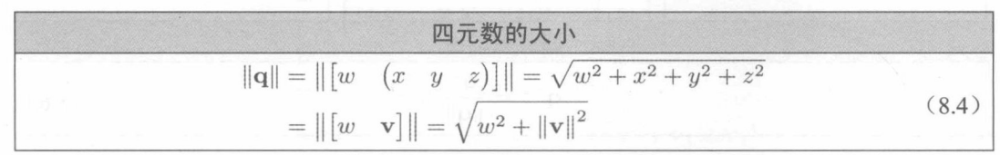

## 1.四元数表示

## 2.四元数取负

## 3.单位四元数

> 根据四元数的几何意义可以得到，当旋转角度θ为360的偶数倍时，得到单位四位数[1,0],θ为360的奇数倍时，得到单位四位数[-1,0]

> 任何四元数q乘以单位四元数[1,0]得到q，乘以[-1,0]得到 -q.在数学上只有[1,0]为单位四元数，在几何上[1,0],[-1, 0]都为单位四元数

## 4.四元数大小

## 5.四元数的共轭与逆
> 共轭：
> 

> 逆:
> 
> 

> 对于表示旋转的四元数，即单位四元数，逆与共轭是等价的
> 

## 6.四元数运算
### 6.1乘法
四元数的积也称为哈密尔顿积,乘法顺序固定从右到左

四元数乘法与三维矢量旋转

四元数乘标量

### 6.2"差"
在数学上，四元数的差更接近与除法

### 6.3点积

### 6.4对数

### 6.5指数

### 6.6幂
> 公式：
> 

> 作用:
> 
> 
>> 理解：首先对四元数q[cos(a),sin(a)n]取对数得到[0,an],然后乘以标量t得到[0,atn],最后进行指数运算得到四元数q'[cos(at),sin(at)n],旋转角度扩大了t倍，旋转轴没有变

> 实现:
在实际的编程中，直接套用公式比较复杂，所以往往是先提取角度a，然后根据幂指数重新计算角度，然后重新计算四元数的w,(x,y,z)

## 7.四元数插值
### 7.1平滑插值Slerp

### 7.2理论公式

### 7.3常用公式

实现
> 
> 
> 
> 

## 参考
> * 3D数学基础：图形和游戏开发第2版