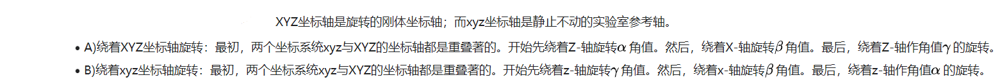
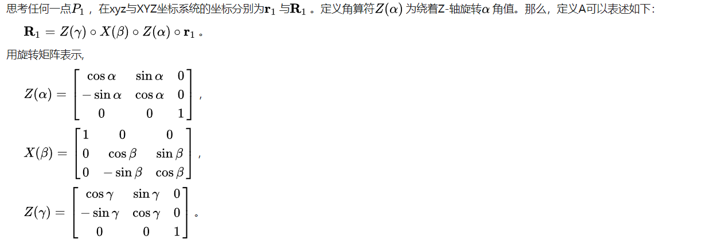
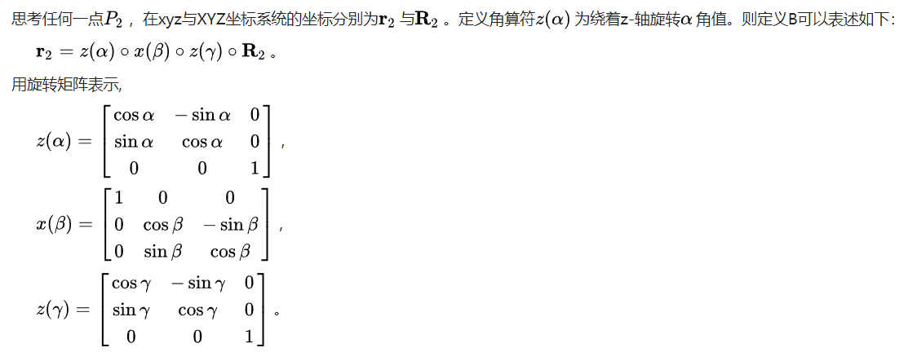
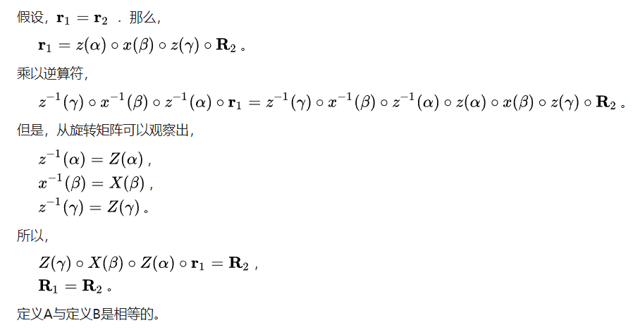
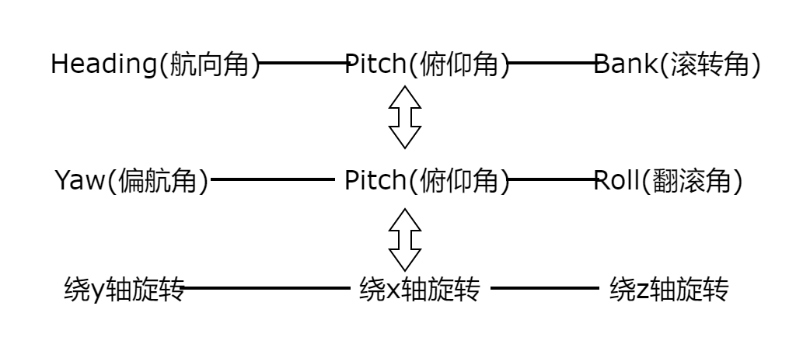
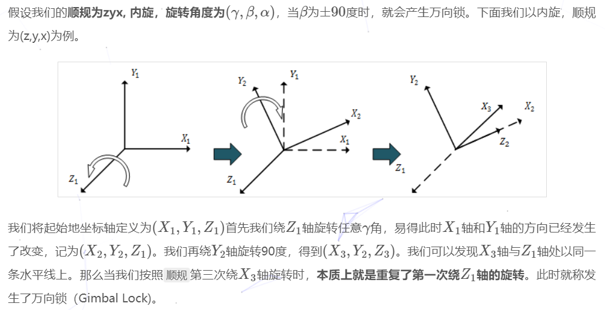

## 1.定义
> * 静态定义:
欧拉角用三个角度值表示一个oritentation
> * 动态定义：
欧拉角将一次旋转，或者说将一个角位移表示为绕着三个互相垂直的旋转序列

## 2.内旋与外旋
动态定义中的旋转有两种方式，内旋与外旋
> * 内旋：绕着刚体自身的体轴进行旋转
> * 外旋: 绕着一个固定坐标系旋转

内旋与外旋是等效的，只要按照相反的顺序进行旋转
证明：

欧拉角一般具有两大类表示方式,每类按照旋转次序的不同分为6小类:

> * (经典欧拉角)Proper Euler angles
>    第一次与第三次旋转轴相同
>    (z-x-z,x-y-x, y-z-y, z-y-z, x-z-x, y-x-y)

> * (泰特布莱恩角)Tait–Bryan angles
>    三次旋转轴都不同 
>    (x-y-z,y-z-x, z-x-y, x-z-y, z-y-x, y-x-z)

## 3.术语

## 4.万向节死锁(Gimbal Lock)
### 4.1定义与产生原因
> 对于一个欧拉角表示的内旋，如果第二次的旋转角度为±90度,会导致第三次与第一次的旋转轴平行，最终导致第一次与第三次旋转的效果相同,使物体丢失了一个自由度

### 4.2.解决
> 1.限制旋转角度，避免第二次转±90度
> 2.四元数

## 参考
> * 3D数学基础：图形和游戏开发第2版
> * [wiki](https://zh.wikipedia.org/wiki/%E6%AC%A7%E6%8B%89%E8%A7%92)
> * <https://hideoninternet.github.io/2020/02/17/36f31d81/>
> * [wiki](https://en.wikipedia.org/wiki/Gimbal_lock)
