# 记录一些和旋转有关的内容
> * 在左手系中，顺时针为旋转的正方向
> * 在右手系中，逆时针为旋转的正方向

## 1.Oritentation
oritentation用来表示一个旋转刚体的位置信息
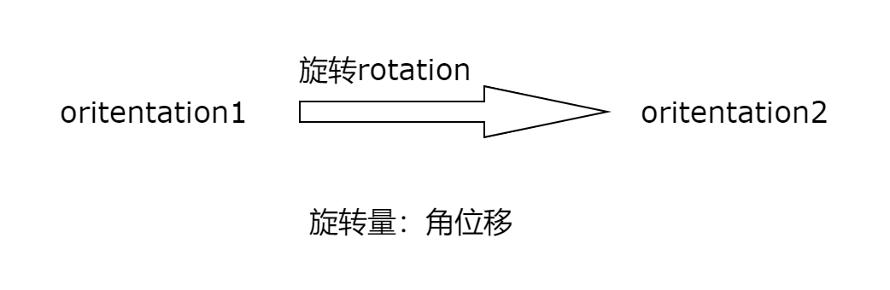
oritentation与角位移在数学形式上等价

## 2.表示
正如我们用x,y,z坐标表示三维空间中的点一样，oritentation也有不同的表示方法

### 2.1矩阵表示

> * 优点
    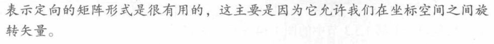
    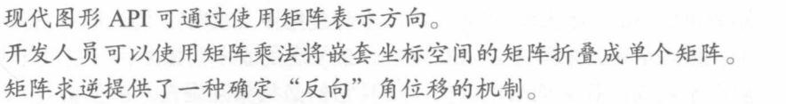
> * 缺点
    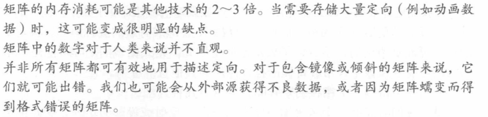

### [2.2欧拉角]()
> * 优点
    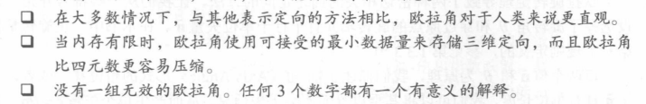
> * 缺点
    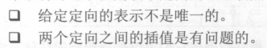
    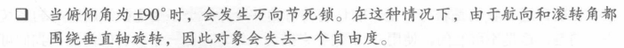
> * 解决方案
    >> 1.对于别名问题，建立规范集
    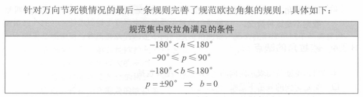
    >> 2.对于插值问题，限制角度差
    对于插值问题主要有以下两种情况
    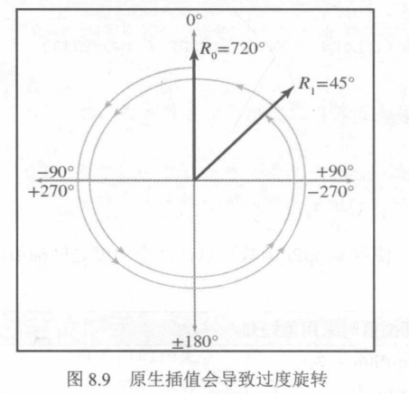
    因为使用了不规范的欧拉角导致插值后的值过大
    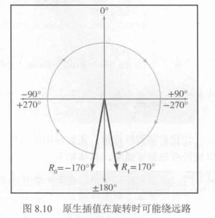
    两个角度原本只相差20，插值时会按照340计算
    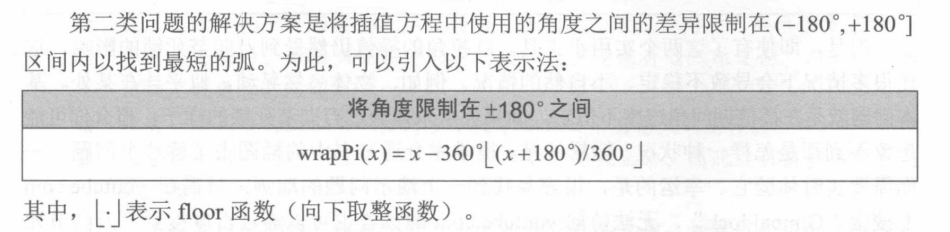
    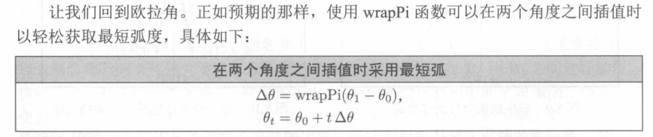
    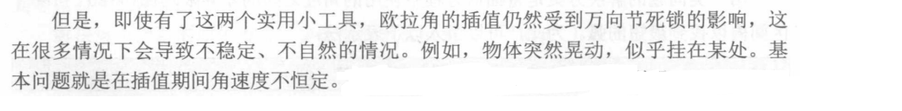

### [2.3四元数]()
> * 优点
    >> 1.可以实现平滑插值
    >> 2.可以使用叉积将一系列角位移连接成单个角位移，运算量比矩阵形式小
    >> 3.相比于欧拉角，四元数可以更快的转化为矩阵形式
> * 缺点
    >> 1.相比与欧拉角只需三个数，四元数的空间开销更大
    >> 2.因为浮点数精度问题，四元数可能无效
    >> 3.四元数对于人来说不直观，难以理解

### 2.4表示形式的转化

## 参考
> * 3D数学基础：图形和游戏开发第2版